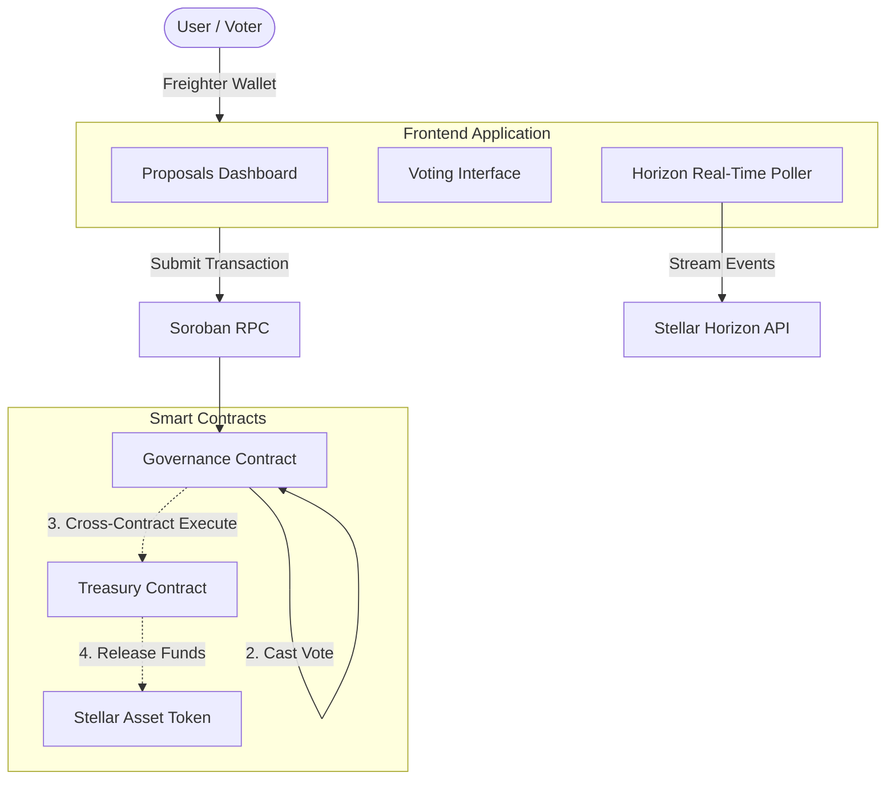
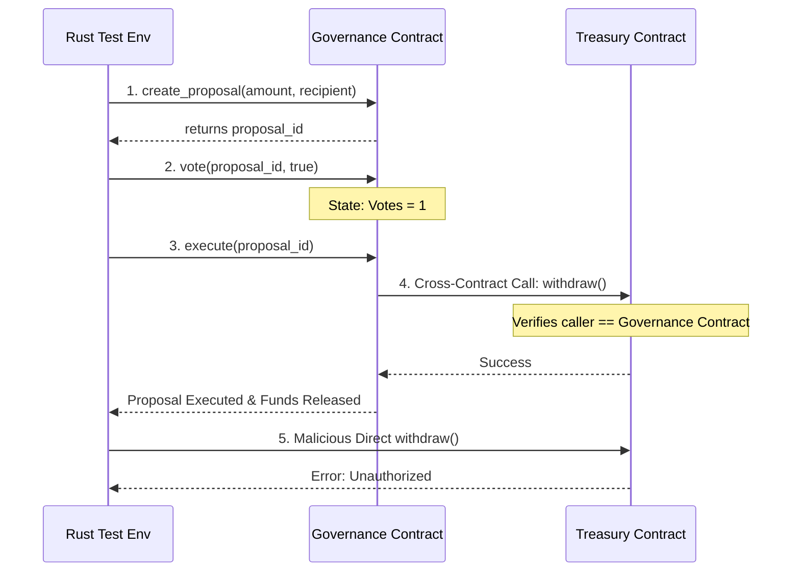

# Nexus DAO: Production-Ready Governance Platform

## Level 3 (L3) Assessment Project

Nexus DAO is a fully decentralized treasury and voting platform built on the Stellar/Soroban network, satisfying all requirements of the Level 3 Web3 curriculum.

## Architecture

## Test Sketches & Validation

To ensure enterprise-grade security for the DAO funds, the project includes comprehensive integration tests. Here is a sketch of the testing architecture validating the core DAO lifecycle:

- **Advanced Contracts (Part A & B)**: Two interacting contracts (Treasury and Governance) enforcing cryptographic security.
- **Real-Time Events (Part C)**: Frontend polls the Horizon API to instantly update the UI when a vote is cast.
- **Responsive UI (Part F)**: Glassmorphism TailwindCSS dashboard built with Next.js and Shadcn/ui.
- **Robust Error Handling (Part G)**: Deep integration with Soroban VM error codes translated to user-friendly Toast notifications.
- **CI/CD Pipeline (Part D)**: GitHub Actions configured for both Rust (`cargo test`) and Frontend (`npm run build`).
- **Testing (Part H)**: Comprehensive smart contract integration testing simulating the full DAO lifecycle.
